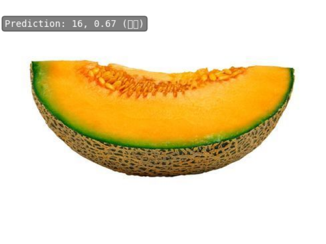

# Env Set/配置环境
```angular2html
conda create -n open-mmlab python=3.8 pytorch==1.10.1 torchvision==0.11.2 cudatoolkit=11.3 -c pytorch -y
conda activate open-mmlab
pip3 install openmim
git clone https://github.com/open-mmlab/mmpretrain.git
cd mmpretrain
mim install -e ".[multimodal]"
```

# DataSet/准备数据集
split dataset
拆分数据集
```angular2html
pip install split-folders
splitfolders --output ../data/fruit30 --ratio 0.8 0.1 0.1 -- ../data/fruit30_train
```

# config/配置
Modify config file, details are as follows:
修改配置文件，详情如下：
[projects/fruit30_Classification/resnet50_fruit_classification.py](resnet50_fruit_classification.py)


# 进行训练
```angular2html
python tools/train.py projects/fruit30_Classification/resnet50_fruit_classification.py --work-dir=./exp
```
results:
```angular2html
06/07 20:08:25 - mmengine - INFO - Saving checkpoint at 98 epochs
06/07 20:08:27 - mmengine - INFO - Epoch(val) [98][4/4]    accuracy/top1: 72.4706  accuracy/top5: 95.5294  data_time: 0.0483  time: 0.1160
06/07 20:08:35 - mmengine - INFO - Exp name: resnet50_fruit_classification_20230607_195318
06/07 20:08:35 - mmengine - INFO - Epoch(train)  [99][28/28]  lr: 1.0000e-04  eta: 0:00:07  time: 0.2611  data_time: 0.0007  memory: 10868  loss: 0.7919
06/07 20:08:35 - mmengine - INFO - Saving checkpoint at 99 epochs
06/07 20:08:36 - mmengine - INFO - Epoch(val) [99][4/4]    accuracy/top1: 72.0000  accuracy/top5: 96.2353  data_time: 0.0484  time: 0.1150
06/07 20:08:44 - mmengine - INFO - Exp name: resnet50_fruit_classification_20230607_195318
06/07 20:08:44 - mmengine - INFO - Epoch(train) [100][28/28]  lr: 1.0000e-04  eta: 0:00:00  time: 0.2659  data_time: 0.0006  memory: 10868  loss: 0.7593
06/07 20:08:44 - mmengine - INFO - Saving checkpoint at 100 epochs
06/07 20:08:45 - mmengine - INFO - Epoch(val) [100][4/4]    accuracy/top1: 72.0000  accuracy/top5: 96.0000  data_time: 0.0481  time: 0.1147

```
# 测试
python tools/test.py projects/fruit30_Classification/resnet50_fruit_classification.py ./exp/epoch_100.pth --work-dir=./exp
results:
```angular2html
 -------------------- 
Loads checkpoint by local backend from path: ./exp/epoch_100.pth
06/07 20:18:20 - mmengine - INFO - Load checkpoint from ./exp/epoch_100.pth
06/07 20:18:21 - mmengine - INFO - Epoch(test) [4/4]    accuracy/top1: 69.3305  accuracy/top5: 94.1685  data_time: 0.1034  time: 0.1926
```
# 推理
```angular2html
from mmpretrain import ImageClassificationInferencer

inferencer = ImageClassificationInferencer('resnet50_fruit_classification.py', pretrained='../../exp/epoch_100.pth')
inferencer('../../../data/fruit30/test/哈密瓜/12.jpg', show='Ture')
```
Results:
