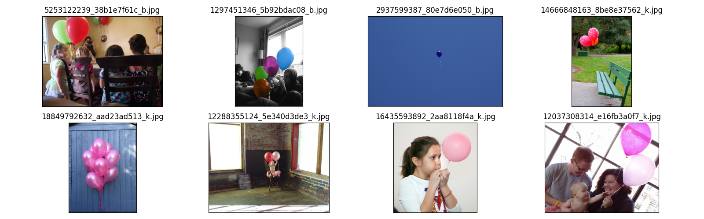
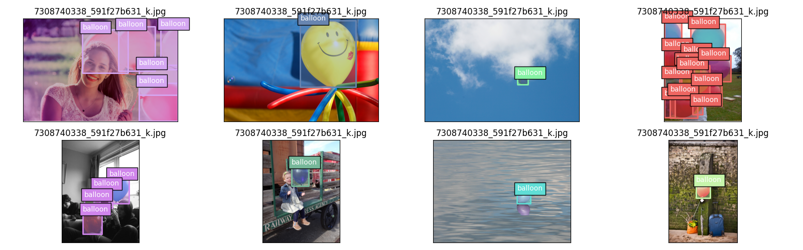
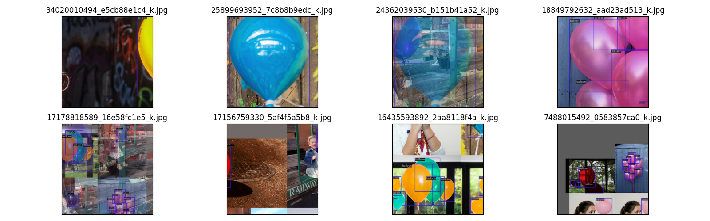
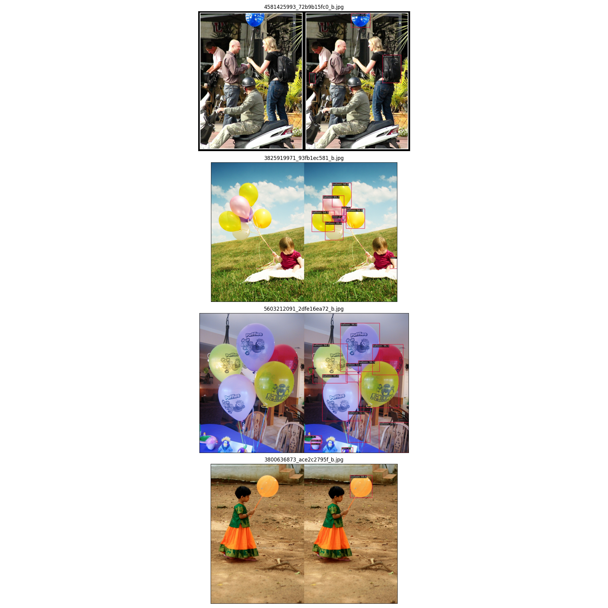
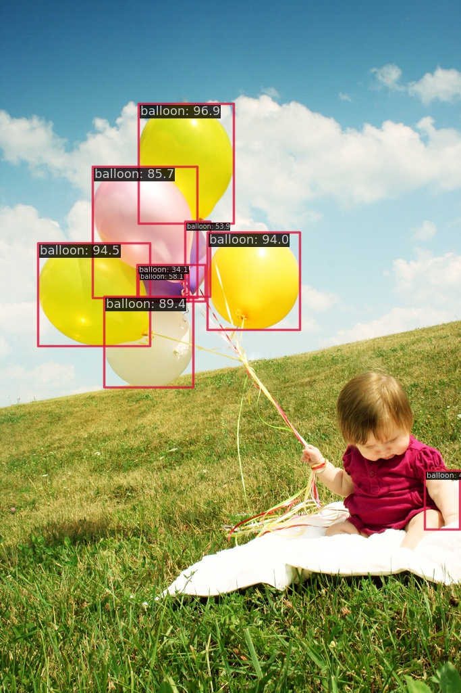
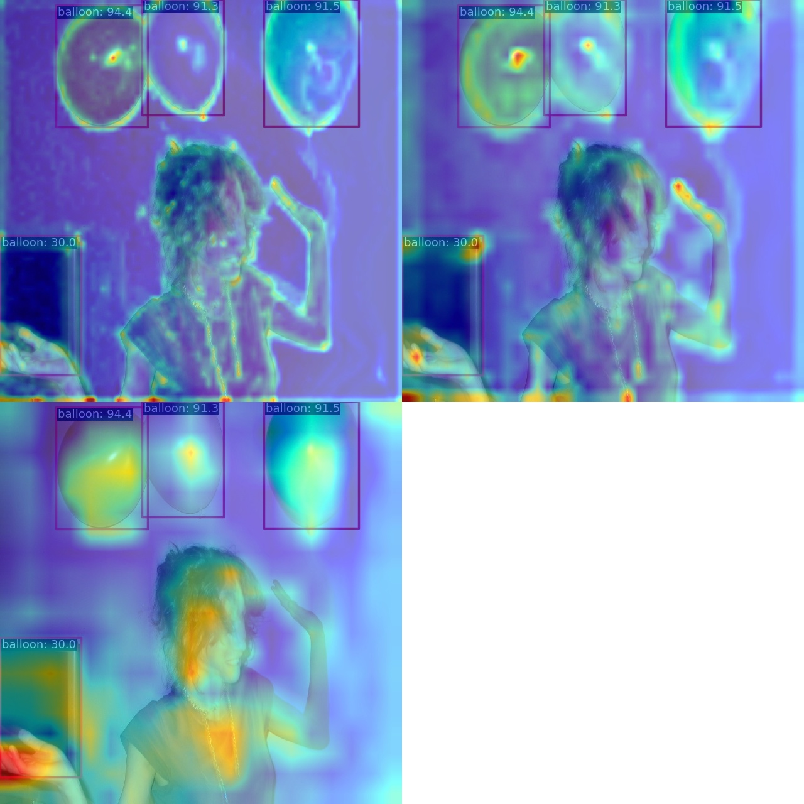
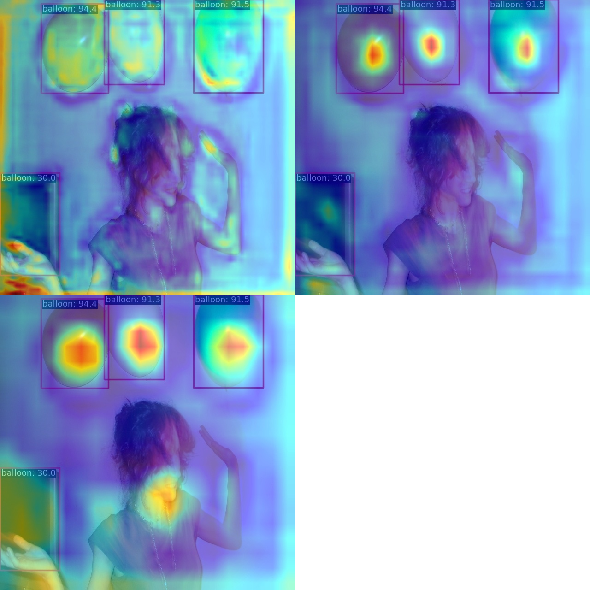

# 1.Show the dataset/展示数据集

Use [json2coco](https://github.com/CrabBoss-lab/openmmlab-Camp/blob/master/03-mmdetection-task/3-json2coco.ipynb) to convert dataset label.

使用[json2coco](https://github.com/CrabBoss-lab/openmmlab-Camp/blob/master/03-mmdetection-task/3-json2coco.ipynb)转化数据集标签。

Show the converted data/展示转化后的数据



# 2.Train/训练

Verify [config](balloon_config.py) files/验证配置文件




Run training/执行训练
```angular2html
python tools/train.py projects/RTMDet_balloon/balloon_config.py
```
Show results/展示结果
```angular2html
06/12 15:12:22 - mmengine - INFO - Saving checkpoint at 40 epochs
06/12 15:12:23 - mmengine - INFO - Epoch(val) [40][ 5/13]    eta: 0:00:00  time: 0.0161  data_time: 0.0051  memory: 191  
06/12 15:12:23 - mmengine - INFO - Epoch(val) [40][10/13]    eta: 0:00:00  time: 0.0155  data_time: 0.0046  memory: 105  
06/12 15:12:23 - mmengine - INFO - Evaluating bbox...
Loading and preparing results...
DONE (t=0.00s)
creating index...
index created!
Running per image evaluation...
Evaluate annotation type *bbox*
DONE (t=0.04s).
Accumulating evaluation results...
DONE (t=0.01s).
 Average Precision  (AP) @[ IoU=0.50:0.95 | area=   all | maxDets=100 ] = 0.742
 Average Precision  (AP) @[ IoU=0.50      | area=   all | maxDets=100 ] = 0.846
 Average Precision  (AP) @[ IoU=0.75      | area=   all | maxDets=100 ] = 0.819
 Average Precision  (AP) @[ IoU=0.50:0.95 | area= small | maxDets=100 ] = 0.000
 Average Precision  (AP) @[ IoU=0.50:0.95 | area=medium | maxDets=100 ] = 0.387
 Average Precision  (AP) @[ IoU=0.50:0.95 | area= large | maxDets=100 ] = 0.877
 Average Recall     (AR) @[ IoU=0.50:0.95 | area=   all | maxDets=  1 ] = 0.244
 Average Recall     (AR) @[ IoU=0.50:0.95 | area=   all | maxDets= 10 ] = 0.780
 Average Recall     (AR) @[ IoU=0.50:0.95 | area=   all | maxDets=100 ] = 0.830
 Average Recall     (AR) @[ IoU=0.50:0.95 | area= small | maxDets=100 ] = 0.000
 Average Recall     (AR) @[ IoU=0.50:0.95 | area=medium | maxDets=100 ] = 0.700
 Average Recall     (AR) @[ IoU=0.50:0.95 | area= large | maxDets=100 ] = 0.919
06/12 15:12:23 - mmengine - INFO - bbox_mAP_copypaste: 0.742 0.846 0.819 0.000 0.387 0.877
06/12 15:12:23 - mmengine - INFO - Epoch(val) [40][13/13]    coco/bbox_mAP: 0.7420  coco/bbox_mAP_50: 0.8460  coco/bbox_mAP_75: 0.8190  coco/bbox_mAP_s: 0.0000  coco/bbox_mAP_m: 0.3870  coco/bbox_mAP_l: 0.8770  data_time: 0.0031  time: 0.0136
06/12 15:12:23 - mmengine - INFO - The previous best checkpoint /home/ubuntu/Openmmlab/MMPose-0524/mmdetection/work_dirs/balloon_config/best_coco_bbox_mAP_epoch_30.pth is removed
06/12 15:12:23 - mmengine - INFO - The best checkpoint with 0.7420 coco/bbox_mAP at 40 epoch is saved to best_coco_bbox_mAP_epoch_40.pth.
```

# 3.Test and inference/测试与推理

```angular2html
python tools/test.py projects/RTMDet_balloon/balloon_config.py work_dirs/balloon_config/best_coco_bbox_mAP_epoch_40.pth --show-dir results
```

Show results/展示结果

```angular2html
Loading and preparing results...
DONE (t=0.00s)
creating index...
index created!
Running per image evaluation...
Evaluate annotation type *bbox*
DONE (t=0.04s).
Accumulating evaluation results...
DONE (t=0.01s).
 Average Precision  (AP) @[ IoU=0.50:0.95 | area=   all | maxDets=100 ] = 0.742
 Average Precision  (AP) @[ IoU=0.50      | area=   all | maxDets=100 ] = 0.846
 Average Precision  (AP) @[ IoU=0.75      | area=   all | maxDets=100 ] = 0.819
 Average Precision  (AP) @[ IoU=0.50:0.95 | area= small | maxDets=100 ] = 0.000
 Average Precision  (AP) @[ IoU=0.50:0.95 | area=medium | maxDets=100 ] = 0.387
 Average Precision  (AP) @[ IoU=0.50:0.95 | area= large | maxDets=100 ] = 0.877
 Average Recall     (AR) @[ IoU=0.50:0.95 | area=   all | maxDets=  1 ] = 0.244
 Average Recall     (AR) @[ IoU=0.50:0.95 | area=   all | maxDets= 10 ] = 0.780
 Average Recall     (AR) @[ IoU=0.50:0.95 | area=   all | maxDets=100 ] = 0.830
 Average Recall     (AR) @[ IoU=0.50:0.95 | area= small | maxDets=100 ] = 0.000
 Average Recall     (AR) @[ IoU=0.50:0.95 | area=medium | maxDets=100 ] = 0.700
 Average Recall     (AR) @[ IoU=0.50:0.95 | area= large | maxDets=100 ] = 0.919
06/12 15:17:19 - mmengine - INFO - bbox_mAP_copypaste: 0.742 0.846 0.819 0.000 0.387 0.877
06/12 15:17:19 - mmengine - INFO - Epoch(test) [13/13]    coco/bbox_mAP: 0.7420  coco/bbox_mAP_50: 0.8460  coco/bbox_mAP_75: 0.8190  coco/bbox_mAP_s: 0.0000  coco/bbox_mAP_m: 0.3870  coco/bbox_mAP_l: 0.8770  data_time: 0.1805  time: 0.1944
```

Show test figures/展示测试图片



Inference/推理

```angular2html
python demo/image_demo.py \
    ../data/balloon/val/3825919971_93fb1ec581_b.jpg \
    projects/RTMDet_balloon/balloon_config.py \
    --weights work_dirs/balloon_config/best_coco_bbox_mAP_epoch_40.pth \
    --show
```

Show/展示



Features of 3 channels from backbone/backbone里3个通道的特征
```angular2html
python demo/featmap_vis_demo.py \
      ../mmdetection/projects/RTMDet_balloon/resized_image.jpg \
      ../mmdetection/projects/RTMDet_balloon/balloon_config.py \
      ../mmdetection/work_dirs/balloon_config/best_coco_bbox_mAP_epoch_40.pth \
      --target-layers backbone  \
      --channel-reduction squeeze_mean
```


Features of 3 channels from backbone/backbone里3个通道的特征
```angular2html
python demo/featmap_vis_demo.py \
      ../mmdetection/projects/RTMDet_balloon/resized_image.jpg \
      ../mmdetection/projects/RTMDet_balloon/balloon_config.py \
      ../mmdetection/work_dirs/balloon_config/best_coco_bbox_mAP_epoch_40.pth \
      --target-layers neck  \
      --channel-reduction squeeze_mean
```


