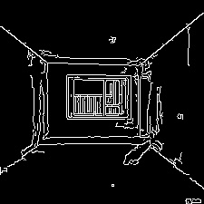

# 边缘检测/Edge detection



# Canny图生图/Canny graphs generate graphs
```angular2html
import cv2
import numpy as np
import mmcv
from mmengine import Config
from PIL import Image

from mmagic.registry import MODELS
from mmagic.utils import register_all_modules

register_all_modules()

cfg = Config.fromfile('../../configs/controlnet/controlnet-canny.py')
controlnet = MODELS.build(cfg.model).cuda()

control_img = mmcv.imread('edges.jpg')
control = cv2.Canny(control_img, 100, 200)
control = control[:, :, None]
control = np.concatenate([control] * 3, axis=2)
control = Image.fromarray(control)

prompt = 'Room with light light silver walls and a pale gold ceiling.'

output_dict = controlnet.infer(prompt, control=control)
samples = output_dict['samples']
for idx, sample in enumerate(samples):
    sample.save(f'sample_{idx}.png')
controls = output_dict['controls']
for idx, control in enumerate(controls):
    control.save(f'control_{idx}.png')
```
Show:

